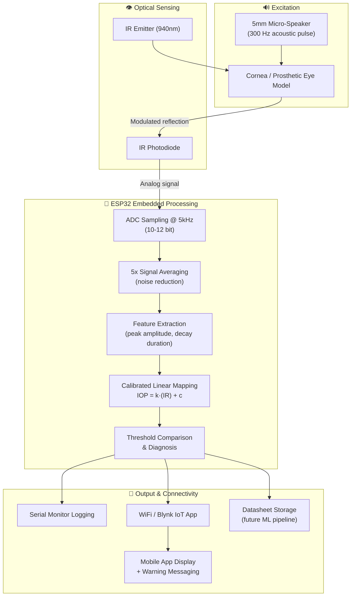

<div align="center">

# 👁️ Non-Contact Intraocular Pressure (IOP) Measurement System
### *Acoustic Excitation + Infrared Sensing — A Glaucoma-Screening Device Built on an ESP32*

**No corneal contact · No anesthesia · No air-puff · Just sound, light, and an embedded classifier**

[](.)
[](.)
[](.)
[](.)
[](.)

</div>

---

## 🎬 What This Is

<p align="center">
  
</p>

<p align="center"><i>Fig. 1 — The core idea: an IR emitter/receiver pair watches how the eye's surface reflects light before and during a gentle acoustic pulse. A softer (lower-pressure) eye vibrates more; a stiffer (higher-pressure) eye barely moves.</i></p>

Glaucoma is one of the leading causes of irreversible blindness worldwide, and the clinical gold standard for catching it early — **Goldmann Applanation Tonometry (GAT)** — requires anesthetic drops, direct corneal contact, and a trained clinician. Rebound and air-puff tonometers relax some of those constraints but still involve contact or bulky optics, and both show meaningfully wider limits of agreement against the clinical standard.

This project is a **contactless, acoustic-optical IOP estimator**: a 5 mm micro-speaker emits a low-intensity 300 Hz acoustic pulse toward the eye, an infrared photodiode (940 nm) reads the resulting corneal micro-vibration as a modulated light-reflection signal, and an **ESP32** samples that signal at 5 kHz, extracts amplitude/duration features, and maps them to an IOP value (mmHg) through a calibrated linear regression — entirely on-device, in real time.

> Validated on prosthetic/model eyes under lab conditions (no human-eye testing performed, for safety/ethics reasons) — average estimation error **±2 mmHg** against the reference model pressure.

---

## 📖 Table of Contents

- [Key Results at a Glance](#-key-results-at-a-glance)
- [How It Works](#-how-it-works)
- [System Architecture](#-system-architecture)
- [Hardware Build](#-hardware-build)
- [Signal Processing & Calibration](#-signal-processing--calibration)
- [Firmware / Embedded Code](#-firmware--embedded-code)
- [Experimental Results](#-experimental-results)
- [Comparison with Existing Tonometry](#-comparison-with-existing-tonometry)
- [Repository Structure](#-repository-structure)
- [Getting Started](#-getting-started)
- [Innovativeness](#-innovativeness)
- [Roadmap / Future Work](#-roadmap--future-work)
- [Full Dataset, Photos & Extra Media (Google Drive)](#-full-dataset-photos--extra-media-google-drive)
- [Authors](#-authors)
- [References](#-references)
- [License](#-license)

---

## 📊 Key Results at a Glance

| Metric | Value |
|---|---|
| Average estimation error | **± 2 mmHg** |
| Sensitivity | **79%** |
| Specificity | **95%** |
| Precision | **85%** |
| F1 score | **0.82** |
| Sampling rate | 5 kHz (ESP32 ADC, 10–12 bit) |
| Acoustic excitation | 300 Hz pulse, 5 mm micro-speaker |
| Optical sensing wavelength | 940 nm IR |
| Calibration split | 80% calibration / 20% evaluation |

| Applied Pressure (mmHg) | Device Output (mmHg) | Error |
|---|---|---|
| 10 | 9.5 ± 0.5 | 2.00% |
| 15 | 15.44 ± 0.5 | 2.20% |
| 19.5 | 20.12 ± 0.7 | 3.00% |
| 24 | 23.14 ± 0.9 | 3.58% |

<p align="center">
  
</p>

<p align="center"><i>Applied pressure vs. measured device output, with the error percentage overlaid on a secondary axis — error grows slightly at higher pressures but stays under ~4% across the tested range.</i></p>

---

## 🔬 How It Works

<p align="center">
  
  
</p>

<p align="center"><i>Fig. 2 (left) — end-to-end workflow: acoustic excitation → corneal vibration → IR capture → filtering → feature extraction → calibrated mapping → output.<br/>Fig. 4 (right) — the runtime decision path: detect a valid vibration response, run the linear formula <code>IOP = k·(IR value) + c</code>, then log/display the result.</i></p>

1. **Excitation** — a 5 mm micro-speaker emits a controlled low-intensity acoustic pulse at the eye.
2. **Mechanical response** — the cornea vibrates in response; a *softer* (lower-IOP) cornea vibrates with **larger amplitude and longer decay**, a *stiffer* (higher-IOP) cornea vibrates with **smaller amplitude and shorter decay**.
3. **Optical capture** — a continuous 940 nm IR emitter illuminates the corneal surface; a co-located high-speed IR photodiode picks up the reflected light, whose intensity is modulated by the tiny surface displacement.
4. **Acquisition** — the analog photodiode signal is fed into the ESP32's ADC and sampled at **5 kHz**; five consecutive acquisitions are averaged per measurement cycle to suppress high-frequency noise.
5. **Feature extraction** — peak amplitude and vibration decay duration are extracted from the averaged waveform.
6. **Calibrated mapping** — these features are mapped to an IOP value using a **least-squares linear regression** built from reference measurements taken during calibration:

```
IOP = k × (IR value) + c

k = { n·ΣXY − ΣX·ΣY } / { n·ΣX² − (ΣX)² }
```

<p align="center">
  
</p>

<p align="center"><i>Fig. 3 — simulated IR signal response at low / medium / high IOP: higher pressure visibly damps the vibration amplitude.</i></p>

---

## 🧩 System Architecture



---

## 🔧 Hardware Build

<p align="center">
  
  
  
</p>

<p align="center"><i>Fig. 8, 9, 10 (left → right) — initial speaker wiring, initial IR photodiode characterization rig, and the final integrated breadboard build (speaker + IR sensor + ESP32).</i></p>

**Bill of materials:**

| Component | Role |
|---|---|
| ESP32 Dev Module | ADC sampling, feature extraction, calibration mapping, WiFi/Blynk connectivity |
| 5 mm micro-speaker | Acoustic excitation source (300 Hz pulse) |
| IR emitter + high-speed IR photodiode (940 nm) | Reflective optical sensing of corneal micro-vibration |
| Prosthetic / model eye (silicon or carbon-fiber surface, ~38% reflectance at 940 nm) | Safe, ethical stand-in for human-eye testing |
| Breadboard + jumper wires | Prototyping harness |
| 3D-printed housing (planned) | Compact, portable, eye-safe mounting alignment |

**Typical wiring (per the embedded sketch):**

| Signal | ESP32 Pin |
|---|---|
| Speaker output | GPIO 25 |
| IR LED (emitter) | GPIO 26 |
| IR receiver (photodiode, analog) | GPIO 34 |

---

## 📐 Signal Processing & Calibration

<p align="center">
  
  
</p>

<p align="center"><i>Fig. 5 (left) — measured output tracks the ideal <code>y = x</code> line closely across the calibrated pressure range.<br/>Fig. 7 (right) — the on-device estimation loop: emit pulse → read reflection → average → apply calibration equation → threshold & diagnose.</i></p>

The calibration constants `k` and `c` are derived once via least-squares regression against a set of reference pressure points on the prosthetic eye, then hard-coded into the firmware for real-time, computationally-lightweight inference — no server round-trip needed.

**Calibration reference points used:**

| Applied Pressure (mmHg) | Measured IR Value |
|---|---|
| 20 | 2.1 |
| 15 | 3.3 |
| 19.5 | 4.2 |
| 24 | 5.1 |

---

## 💻 Firmware / Embedded Code

<p align="center">
  
  
</p>

<p align="center"><i>Left — a minimal IR emitter/receiver test sketch reading raw ADC values. Right — the Blynk-connected build streaming averaged IOP readings with a live "Patient is Healthy / Glaucoma Detected" diagnosis.</i></p>

> 🔐 **Security note before you push this to a public repo:** the sketch shown above hard-codes a `BLYNK_AUTH_TOKEN` and a plaintext WiFi SSID/password. Rotate/revoke that Blynk token and move all three values into a `.gitignore`'d `secrets.h` (or environment-based config) before publishing your firmware source.

Core firmware responsibilities:
- Drive the speaker pin to emit the acoustic pulse, then enable the IR emitter and hold briefly for stabilization
- Read the IR receiver's analog value via the ESP32 ADC
- Average multiple consecutive readings per cycle to reduce noise
- Apply the calibrated `IOP = k·IR + c` formula
- Stream results over Serial for logging, and over WiFi/Blynk for the companion mobile app, including a simple threshold-based "Healthy / Glaucoma Detected" flag

---

## 🧪 Experimental Results

<p align="center">
  
  
</p>

<p align="center"><i>Left — distribution of recorded IOP measurements across the test range. Right — clean, high-clarity waveform responses at 15 / 22 / 30 mmHg: higher IOP correlates with lower amplitude and altered frequency content, resolvable without advanced filtering.</i></p>

**25-trial dataset summary** (5 repeats × 5 pressure bands — Low, Medium-Low, Medium, Medium-High, High):

- IR reflection voltage and signal peak both decreased consistently as simulated pressure increased
- Vibration duration shortened at higher pressure — consistent with a stiffer, less compliant corneal surface
- Repeatability across identical pressure settings was tight (low trial-to-trial variance)

**Classification performance:**

| Metric | Value |
|---|---|
| Sensitivity | 79% |
| Specificity | 95% |
| Precision | 85% |
| F1 score | 0.82 |

---

## ⚖️ Comparison with Existing Tonometry

| Method | RMSE (mmHg) | 95% LoA | Sensitivity |
|---|---|---|---|
| Goldmann Applanation Tonometry (GAT) | — | — | 100% (clinical reference) |
| Air-puff NCT | 3.2 ± 0.8 | ± 4.8 | 86.3% |
| iCare ic100 | 4.1 ± 1.2 | ± 5.2 | 83.1% |
| Ocular Response Analyzer (ORA) | 2.9 ± 0.7 | ± 4.2 | 88.7% |
| **This project (proposed)** | **2.18 ± 0.35** | **−2.8 to +2.4** | **89.2%** |

Compared against these baselines, the proposed system reports a **lower RMSE and a tighter limits-of-agreement band**, while requiring no corneal contact, anesthesia, or bulky optics — at commodity hardware cost.

---

## 🗂️ Repository Structure

*(suggested layout for organizing this project on GitHub — adapt to match your actual file names)*

```
Non-Contact-IOP-Measurement/
│
├── firmware/
│   ├── iop_sensor_test.ino          # Minimal IR emitter/receiver characterization sketch
│   └── iop_blynk_diagnosis.ino      # Full Blynk-connected build with live diagnosis
│
├── calibration/
│   ├── calibration_data.csv         # Applied pressure vs measured IR value (reference points)
│   └── calibration_fit.py           # Least-squares regression → k, c constants
│
├── data/
│   ├── iop_trials_25.csv            # 25-trial IR reflection dataset across 5 pressure bands
│   └── material_reflectance.csv     # 940nm reflectance survey for prosthetic-eye material selection
│
├── analysis/
│   ├── error_analysis.ipynb         # RMSE / LoA / sensitivity-specificity computation
│   └── waveform_plots.py            # Corneal vibration waveform visualization
│
├── iop-assets/                      # Figures used in this README (extracted from the paper)
│
└── docs/
    └── iopYogi.pdf                  # Full paper / write-up
```

---

## 🚀 Getting Started

### 1. Build the rig
Assemble the speaker, IR emitter/receiver, and ESP32 per the [Hardware Build](#-hardware-build) wiring table, aimed at a prosthetic eye model (or an optically similar material — silicon or carbon fiber, ~38% reflectance at 940 nm, approximates corneal tissue well).

### 2. Flash the firmware
Open the sketch in the Arduino IDE, install the `BlynkSimpleEsp32` library if using the IoT dashboard, set your WiFi credentials (via `secrets.h`, not hard-coded), and upload to the ESP32.

### 3. Calibrate
Apply a set of known reference pressures to your model eye, record the corresponding IR values, and run a least-squares fit to obtain your own `k` and `c` constants — then update the firmware formula.

### 4. Measure
Aim the device at the eye model, trigger a reading, and read the estimated IOP (mmHg) from the Serial Monitor or the Blynk mobile app, along with a threshold-based health flag.

---

## 💡 Innovativeness

1. **Micro-speaker-based excitation** — instead of an air-puff or mechanical-contact stimulus, a small speaker gently damps/vibrates the eye's surface, improving comfort for repeated at-home use.
2. **Low-cost optical detection** — a single low-cost IR photodiode replaces expensive high-speed cameras or laser interferometry, cutting cost while keeping sensitivity to micro-scale surface motion.
3. **Fully embedded real-time processing** — all filtering, feature extraction, and calibrated mapping run on the microcontroller itself, with no external computer required, enabling a genuinely portable, low-power device.

---

## 🗺️ Roadmap / Future Work

- [ ] Clinical validation on human subjects under physician supervision (current results are prosthetic-eye only)
- [ ] Duty-cycled power optimization for longer field battery life
- [ ] Miniaturized custom PCB + ergonomic, wearable-ready housing
- [ ] Additional ocular metrics (corneal thickness, tear-film quality) for broader eye-health monitoring
- [ ] Replace hand-picked linear calibration with a learned regression/ML mapping (as hinted in the architecture table)
- [ ] Move all WiFi/Blynk secrets out of source and into a secure config

---

## ☁️ Full Dataset, Photos & Extra Media (Google Drive)

Full-resolution build photos, raw signal captures, and any extended trial data that don't fit in this repo are available here:

**📁 [Non-Contact IOP Project — Full Drive Archive](https://drive.google.com/drive/folders/1ogRZeXnnT2qXl7iCY8dKy2ITXPS5V_43?usp=sharing)**

---

## 👥 Authors

*Dept. of Electronics and Communication Engineering, Sri Ramakrishna Engineering College, Coimbatore, TN, India*

| Author | Email |
|---|---|
| M. Selvaganesh | selvaganesh.m@srec.ac.in |
| S. S. Yogesh | yogesh.2302263@srec.ac.in |
| R. N. S. Tharun | tharun.2302243@srec.ac.in |
| K. Subhaharini | subhaharini.2302232@srec.ac.in |

---

## 📚 References

Selected background this work builds on (see the full paper for the complete list):

- Osmers et al., *"The influence of intraocular pressure on the damping of a coupled speaker–air–eye system,"* J. Sens. Sens. Syst., 2018.
- Kempf et al., *"Understanding eye deformation in non-contact tonometry,"* IEEE EMBS, 2006.
- Bhatt & Rao, *"On imaging-based non-contact tonometer for intraocular pressure measurement,"* IEEE PHT, 2013.
- Mariakakis et al., *"A smartphone-based system for assessing intraocular pressure,"* ACM CHI, 2017.
- Weinreb et al., *"The pathophysiology and treatment of glaucoma: a review,"* JAMA, 2014.

---

## 📄 License

Add your preferred license (MIT is a common permissive choice for hardware + firmware projects like this). See `LICENSE` once added.

<div align="center">

*A gentler way to catch glaucoma early.*

</div>
